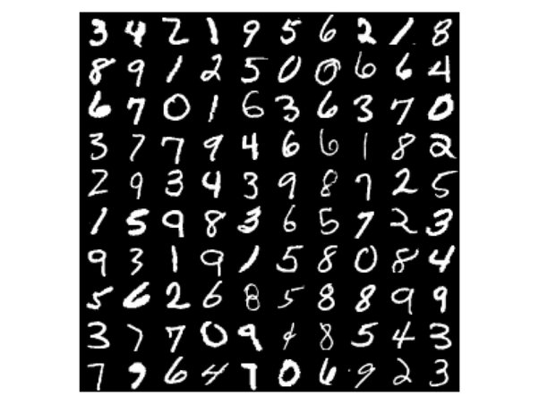

# Code your First Machine Learning Model
In this lab session you are a Data Scientist who has been tasked with trying to develop a Model to be able to recognise hand written single digits (0-9) using Machine Learning. We will have a dataset known as  "MNIST Handwritten Digit" which has 70,000 (28x28) different pictures of handwritten digits.
Our task for today will be Loading the dataset, viewing the data, training an ML model and then finally testing the model to see how well it performs.
## Packages and Tools
Before we start with the labs code there will be a few open source Python packages we will be using to help us on our Machine Learning journey. These packages come with the SageMaker preinstalled however if you would like to recrete this lab on your local machine you may need to run "pip install packagename" in your terminal beforehand
| Package Name      | Description | Link to Documentation |
| ----------- | ----------- | ----------- |
| Matplotlib      | Matplotlib is a comprehensive library for creating static, animated, and interactive visualizations of data.     | https://matplotlib.org/       |
| Pandas   | Pandas is a fast, powerful, flexible and easy to use open source data analysis and manipulation tool       | https://pandas.pydata.org/        |
| Sklearn   | Sklearn contains simple and efficient tools for machine learning such as different algorithms to be trained and useful functions for preprocessing data and model evaluation       | https://scikit-learn.org/stable/        |
| Numpy   | NumPy is a Python library used for working with arrays and scientific computation. | https://numpy.org/ 
| Seaborn   | seaborn is another Python library used for plotting graphs and figures (similar to matplotlib) | https://seaborn.pydata.org/
## MNIST (Modified National Institute of Standards and Technology database) Data
We can now move on to downloading our dataset for the lab. Luckily for us, the data is open source and it is conviently included in the sklearn package. From sklearn we can use the 'fetch_openml' function which will allow us to import our image data. We specify that we want the 'mnist_784' dataset which contains our 70,000 28x28 handwritten images.

```python
from sklearn.datasets import fetch_openml
mnist = fetch_openml('mnist_784', version=1, as_frame=False)
```
This data is loaded in as a dictionary, with a bunch of extra data. For our labs we are only interested in 'data' which contains the pixel data of the image and 'target' which contains the labels for the image (0-9).
```python
mnist.keys()
```
We can take our two columns (Data and target) and place them into the variables X and y
```python
X, y = mnist["data"], mnist["target"]
```
Just to double check we have the right number of images we can use the len() function to count the total number of images in X
```python
len(X)
```
We can use the matplotlib package to visualise the first picture of the digit in our dataset
```python
%matplotlib inline
import matplotlib as mpl
import matplotlib.pyplot as plt
def plot_digit(data):
    image = data.reshape(28, 28)
    plt.imshow(image, cmap = mpl.cm.binary)
    plt.axis("off")
plot_digit(X[0])
```
As we can clearly see this is a picture of a 5, we can check the labels which is in the y variable to double check this
```python
y[0]
```
Since the labels are current a string datatype, we need to convert them into integers so the machine learning algorithm can properly process them as an input. To do this we can use the numpy library for processing numbers in Python.
```python
import numpy as np
y = y.astype(np.uint8)
```
Now that we have our labels in the correct format, we can look at the pixel data which contains the image we are attempting to classify which we placed in the X variable. Lets look at the pixel data first image in our dataset.
```python
X[0]
```
As you can see the numbers are ranging from 0-255 where 255 represents a pixel which is white and zero represents a pixel which is black (off). In this example we have greyscale images however if we had a colour image each pixel would have 3 numerical values (0-255) which would represent the colors R (Red), B (Blue), G (Green).
Checking the length of our array we can see we have 784 different values, each value representing a pixel in our 28x28 image.
```python
len(X[0])
```
Before we feed our data into our algorithm of choice, we need to split the data into two sets; training data and testing data. 
The training data set is the dataset which we will feed into the model to be used during the learning process, in this step we feed in the pixel data (**X_train**) and the answers (**y_train**) hoping that the model will learn enough information from the pictures to correlate with the given labels.  
The test data set is the dataset which we will use to test the model **after** the training process. This will allow us to properly evaluate how well the model is performing on unseen data. To do this we feed in the pixel data (**X_test**) and save the predicted outputs of the model. We can then compare with the real labels (**y_test**) and check how many our model is getting correct.
Generally its best practice to have more training data than testing data, in our use case we will take the first 60,000 images to be our training data and the remaining 10,000 images will be saved for testing purposes.
```python
X_train, X_test, y_train, y_test = X[:60000], X[60000:], y[:60000], y[60000:]
```
## Model Training
There are various different algorithms that we can train each with their own unique strengths and weaknesses. Luckily for us most of these algorithms can be found prebuilt for us in the sklearn package so we can easily import a model from there. In our demo we are going to be using the Stochastic Gradient Descent (SGD) Classifier model. We wont be going into detail how this algorithm works however if you would like to do some extra reading I would reccomend this article: [SGD Link](https://www.geeksforgeeks.org/ml-stochastic-gradient-descent-sgd/).
Once we import our model we can fit it using the training dataset: X_train (Images) and y_train (Labels)
**note**: this may take a few minutes to fit
```python
from sklearn.linear_model import SGDClassifier
sgd_clf = SGDClassifier(random_state=42)
sgd_clf.fit(X_train, y_train)
```
.. and thats it ! We successfully fitted our first ML Learning algorithm but now we need to figure out if we managed to produce a **good** model that can accurately predict a handwritten digit or if we produced a model that is just spitting out nonsense. Lets test it using our testing set that we reserved from earlier.
```python
n=10
prediction = sgd_clf.predict([X_test[n]])
print(f"Our Machine Learning Model is predicting {prediction[0]}")
```
```python
plot_digit(X_test[n])
```
It looks like its doing ok! Lets see if we can get a prediction on the entire testing set and then use that to calculate some metrics about our model performance. We can do this by passing in the entire X_test into the predict function.
```python
predictions = sgd_clf.predict(X_test)
```
As expected we are going to get back an array of values each element being an individual prediction, we can then take this predictions array and compare with the real labels (**y_test**) to see how many we are getting correct.
```python
predictions
```
```python
len(predictions)
```
```python
from sklearn.metrics import accuracy_score
print(f"Accuracy of Machine Learning Model: {accuracy_score(y_test,predictions)*100}%")
```
Great, it looks like our machine learning model is predicting with a reasonabily high accuracy, lets take a deeper look at how our model is perfromaning by plotting something called a confusion matrix
```python
from sklearn.metrics import confusion_matrix
import pandas as pd
import seaborn as sns
cm = confusion_matrix(y_test,predictions)
cm_df = pd.DataFrame(cm,
                     index = ['0', '1', '2', '3', '4', '5', '6', '7', '8', '9'], 
                     columns = ['0', '1', '2', '3', '4', '5', '6', '7', '8', '9'])
#Plotting the confusion matrix
plt.figure(figsize=(15,15))
sns.heatmap(cm_df, annot=True,cmap='Blues',fmt='g')
plt.title('Confusion Matrix')
plt.ylabel('Actual Values')
plt.xlabel('Predicted Values')
plt.show()
```
```python
(902+1095+803+931+778+709+854+919+872+877)/10000
```

